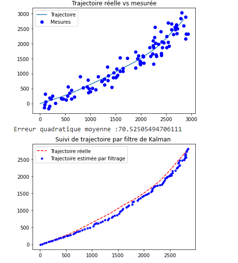

# Poursuite de cible par filtrage de Kalman et particulaire 📡

Poursuite de cible par filtrage de Kalman à partir de mesures bruitées, détéction de visages par filtrage particulaire. Modèle de Kitagawa (économétrie) par filtrage

## Trajectoire de la cible estimée par le filtrage de Kalman avec erreur quadratique moyenne : 

  

